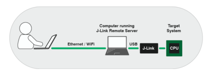

# remote-jlink-programming

In recent events many have found there selfs at home and not being able to go to office. For me physically this was not something new as I have been working remote for caple of years now and I wanted to show one less known feature of Segger JLink which provides programming interface over the internet as the device you are programming is sitting next to you on the bench. 

For this example I will use the nRF52-DK development board from Nordic Semi. This board has nRF52832 SoC onboard which has Arm® Cortex®-M4 32-bit processor with FPU, 64 MHz, and 512 kB flash/64 kB RAM memory. This will be important later on when we need to figure out the start address for the application firmware. 

## server configuration
There are three ways how to do programming with JLink and you can read more about it on [Segger website](https://www.segger.com/products/debug-probes/j-link/tools/j-link-remote-server/). I will demonstrate the "LAN" way, where the device is connected to one computer using the JLink programmator and I am programming that chip over LAN connection. 

<p align="center">
  
</p>

 * picture source: [link](https://www.segger.com/products/debug-probes/j-link/tools/j-link-remote-server/)

The computer with the target device has Windows 10 OS and it is a simple process to start the JLink server on it. After installing JLink software search for **SEGGER J-Link Remote Server** and start the application. On first configuration windows select parameters as in the picture:  

<p align="center">
  
</p>

After the configuration, the server has started and the IP address in my case is as shown in the picture. To be able to see what is happening with the server enables the **show log** configuration for easier tracking.  

<p align="center">
  
</p>

## client configuration
On the client-side main development, the machine is using Ubuntu 18.04 LTS OS. This will allow us to easily create scripts that will help us to achieve firmware download over LAN.

First it is necessary to install [Segger J-Link software package](https://www.segger.com/downloads/jlink/). After that connection with the server need to be established so the firmware can be downloaded. To do that you can call JLink software from the command line with IP address of server machine as a parameter, for example:
```bash
$ JLinkExe ip 192.168.13.229
```
This will get you a connected command line into the remote terminal. You can then start configuration manually in the Jlink terminal by typing `connect` or `help` for more information. But the goal is to this in one "click".
This is why we will create a script called **flash_remote.sh** with all the commands you would manually type to program MCU on the server-side. 

```
si SWD
Speed 4000
device nrf52832_xxaa
connect
loadbin _build/nrf52832_xxaa.bin 0x00026000
r
exit
```
To explain each line so the script is more understandable:
1. `si SWD` - configures that JLink uses SWD for programming and debugging
2. `Speed 4000` - configures SWD speed (4000 default value)
3. `device nrf52832_xxaa` - configures the target device, you can set your own
4. `connect` - JLink is connecting to the device with previously set parameters
5. `loadbin _build/nrf52832_xxaa 0x00026000` - loadbin command will take two parameters, first location of application bin file and second start address in memory, and flash the firmware. Start address can be found in the chip documentation or in the linker file of the MCU (for [nRF52 devices memmory](https://learn.adafruit.com/bluefruit-nrf52-feather-learning-guide/hathach-memory-map)) 

now we can call JLink software with next parameters:
```bash
$ JLinkExe ip 192.168.13.229 flash_remote.sh
```
and the programm will be downloaded to the MCU.

## notes
* this example was done for a Linux client and in theory it should work on Windows client as well, but it has not been tested. 

## references
1. https://iosoft.blog/category/nordic-nrf52/
2. http://wiki.hivetool.org/NRF52840_Development
3. https://docs.electronut.in/papyr/programming_guide/#upload-hex-file
4. https://aurabindo.in/nordic-and-open-source-goodness/
5. https://diyiot.wordpress.com/2015/11/29/ble-application-with-nrf51822-firmware-flashing/
6. https://www.segger.com/products/debug-probes/j-link/tools/j-link-remote-server/
